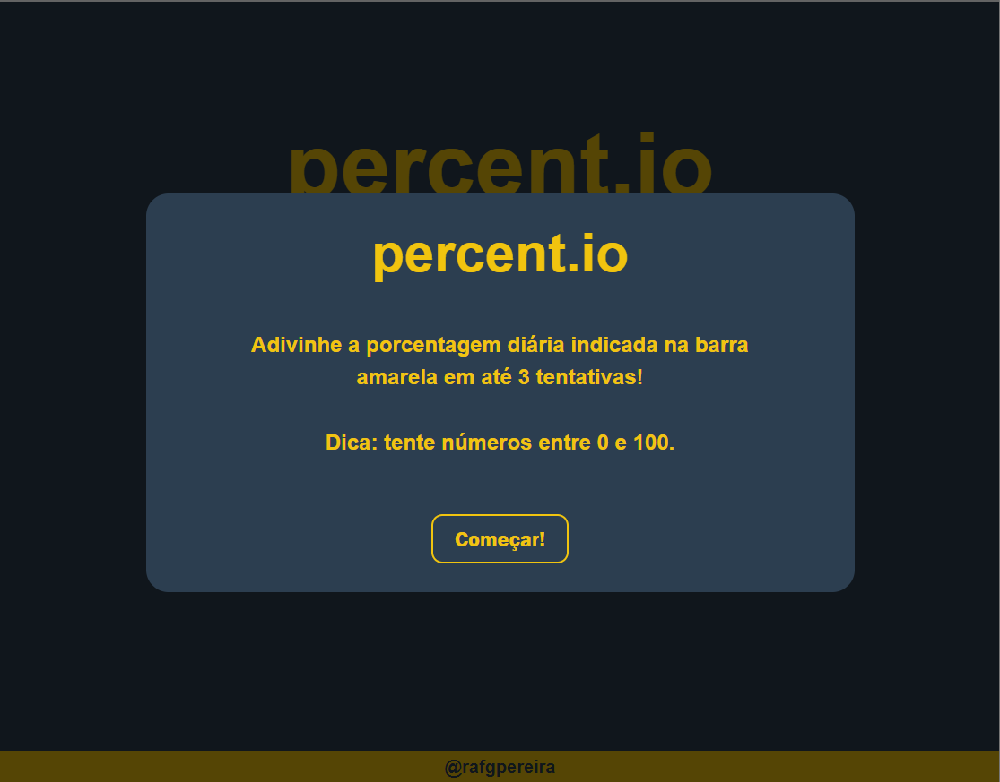
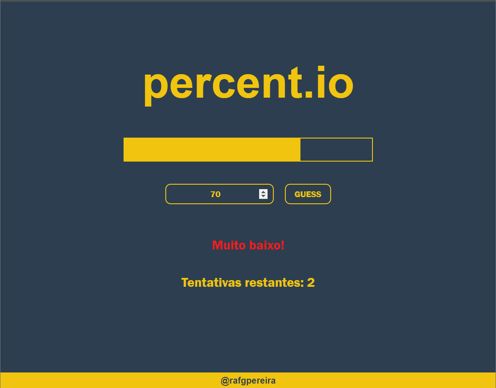
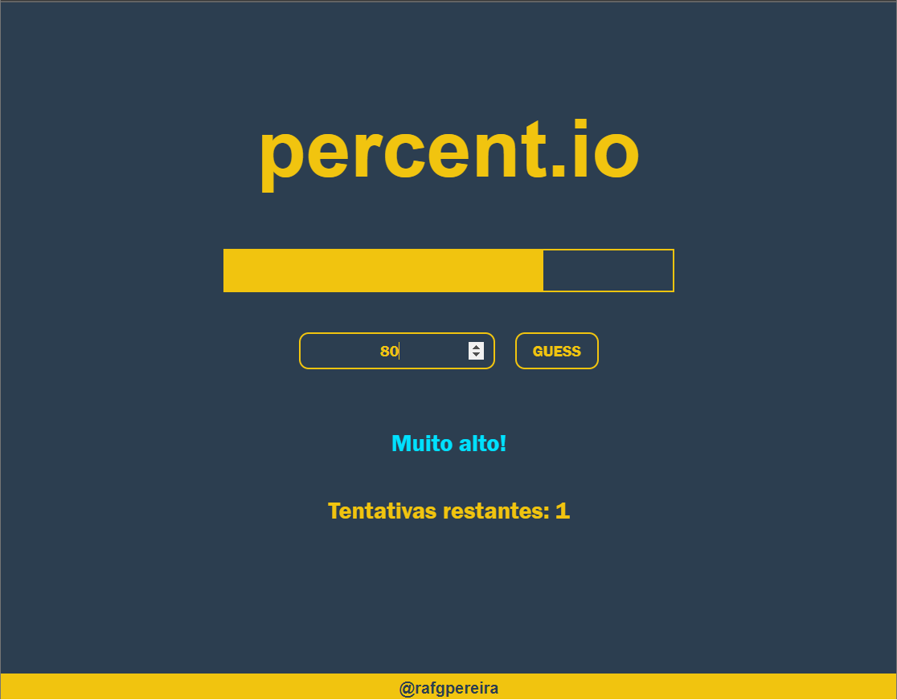
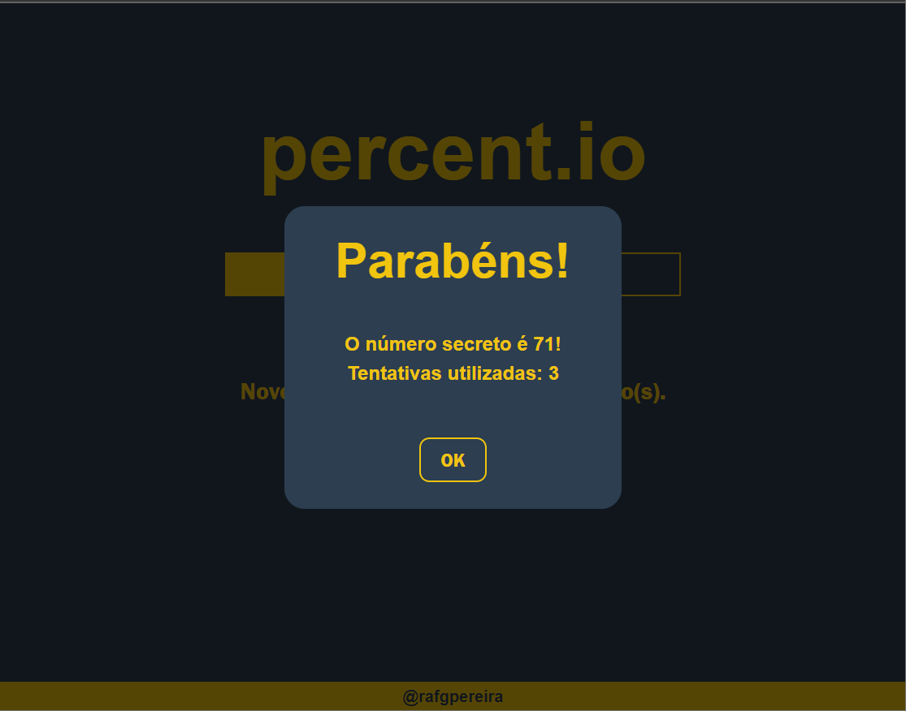
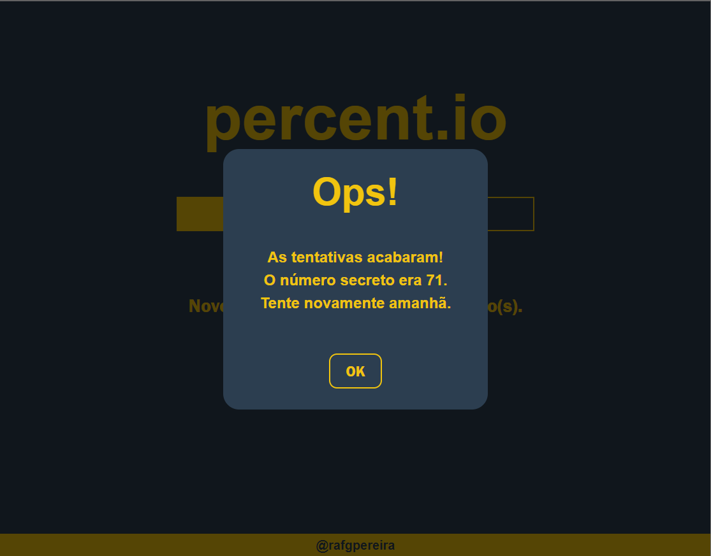
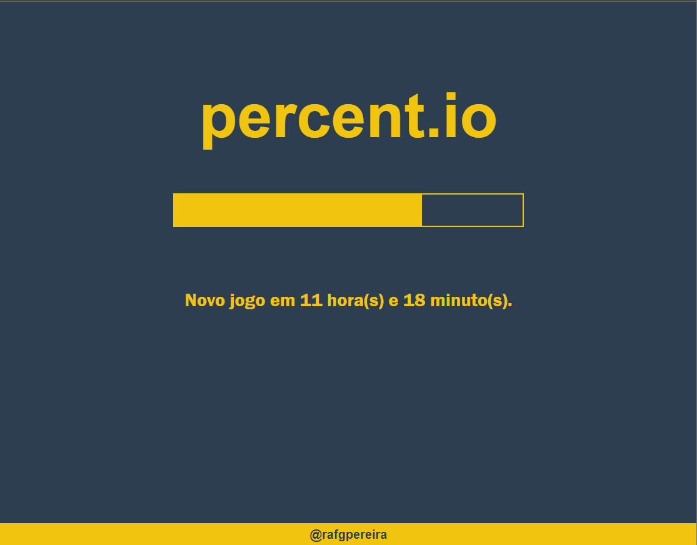

# percent.io

Este é um jogo diário no qual o usuário deve adivinhar a porcentagem preenchida de uma barra de progresso em até 3 tentativas.
As tentativas são recarregadas diariamente.
[Jogue agora!](https://percentgame.netlify.app/)

## Conteúdos Aplicados

### HTML

- Estrutura semântica de tags
- Tag dialog para notificações

### CSS

- Conceito e aplicação de BoxModel
- Responsividade com unidades de medida dinâmicas
- Variáveis para estilização dinâmica de elementos (barra de progresso)

### JS

- Manipulação do Local Storage (tentativas e partida diária)
- Funções
- Objetos
- Manipulação do DOM

### Deployment

-Deploy do projeto no Netlify para hospedagem e disponibilização online

## Demonstração

Clique [aqui](https://percentgame.netlify.app/) para acessar o jogo online ou veja as capturas de tela abaixo.

### Apresentação

### Jogando

### Vitória/Derrota

### Próximo jogo

